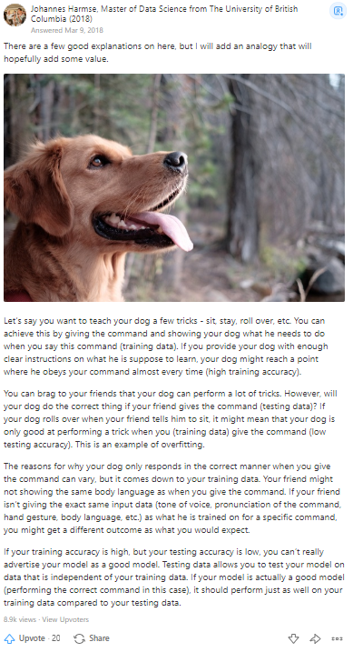

# Data Preprocessing

## Step by Step

### 1. Import some common libraries 

```python
  import numpy as np
  import pandas as pd
  import matplotlib.pyplot as plt 
```

### 2. Import dataset then split dependent and independent features

 ```python
   dataset = pd.read_csv('Data.csv')
   # Independent features
   X = dataset.iloc[:,:-1].values
   # Dependent features
   Y = dataser.iloc[:,3].values
  ```
  
  #### *Explain*
  
      - Independent features are used for making predict
      - Dependent features are what you want machine to predict and depend on Independent features
     
### 4. Handle missing data

#### *1. Library:*
  
  **Imputer** from sklearn.preprogressing**  (scikit version **<= 2.0**)
  
  **SimpleImputer** from sklearn.impute**    (scikit version **>=2.2**)
  
  ```python
    from sklearn.impute import SimpleImputer
    imputer = SimpleImputer(missing_values = np.nan , strategy = 'mean', verbose=0)
    # vebose = 0 is mean of column , = 1 is mean of row
    imputer = imputer.fit(X[:, 1:3])
    X[: , 1:3] = imputer.transform(X[:, 1:3])
  ```
 #### *2. Explain*
 
    Missing data cause difficulte in learning so we must replace them by other values,
    an usual stategy is replace mean value
    
 ### 5. Categorical Data
 
   #### *Recognize Categorical Data*
      Name
      Yes/No
   #### *Why need to categorical ?
      - Categorical data usually in text, and the machine-learning process using math euqation to predict the result,
      So we must change them into number data for not causing errors
   ### *Library for categorical :
   
   **OneHotEncoder** from **sklearning.preprocessing**
   
   **ColumnTransformer** from **sklearn.compose**
   
```python
   columnTransformer = ColumnTransformer([('encoder', OneHotEncoder(), [0])], remainder='passthrough')
```
     
   ##### [oneHotEncoder_document](https://scikit-learn.org/stable/modules/generated/sklearn.preprocessing.OneHotEncoder.html)
   
   ##### [ColumnTransformer_document](https://scikit-learn.org/stable/modules/generated/sklearn.compose.ColumnTransformer.html)
   
### 6. Split dataset into Traning set and Test set

  ### *My favorite explaination about why need to split dataset into Training and Test set:*
  
  
  ### *Library:
  
  **from sklearn.model_selection** import **train_test_split**
  
  ```python
   from sklearn.model_selection import train_test_split
   X_train, X_test, Y_train, Y_test = train_test_split(X, Y, test_size = 0.2, random_state = 0)
  ```
### 7. Feature scaling

  ### When need to scaling?
  
      - Real world dataset contains features that highly vary in magnitudes, units, and range. 
      Normalisation should be performed when the scale of a feature is irrelevant or misleading and 
      not should Normalise when the scale is meaningful.

      - The algorithms which use Euclidean Distance measure are sensitive to Magnitudes. 
       There feature scaling helps to weigh all the features equally.

       - Formally, If a feature in the dataset is big in scale compared to others then in algorithms 
       where Euclidean distance is measured this big scaled feature becomes dominating and needs to be normalized
  
  ```python
   from sklearn.preprocessing import StandardScaler
    sc_X =StandardScaler()
    X_Train = sc_X.fit_transform(X_train)
    X_test = sc_X.fit_transform(X_test)
  ```
  ### That's all step to preprocessing data
  
  > *write-up by [ts](https://www.facebook.com/tstheloser)
  
  ### reference source:
  
  ### *Course*
  
  [Udemy ML course](https://www.udemy.com/course/machinelearning/)
  
  ### *Youtube Chanel*
  
  [365 Data Science](https://www.youtube.com/channel/UCEBpSZhI1X8WaP-kY_2LLcg)
  
  [Joma Tech](https://www.youtube.com/channel/UCV0qA-eDDICsRR9rPcnG7tw)
